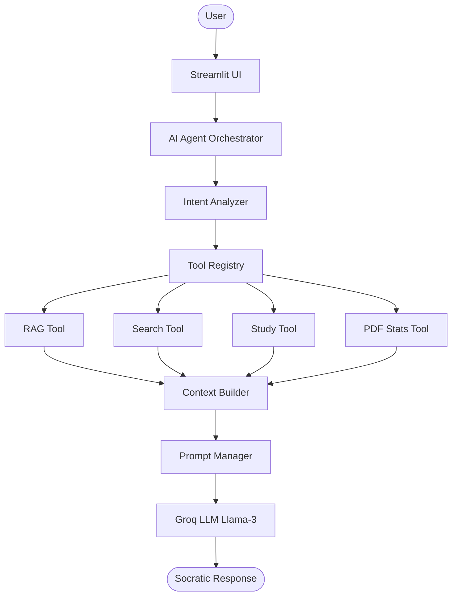

# EduMentor AI — Production Ready Socratic Tutor & Educational Assistant

EduMentor AI is a production-grade educational Socratic Tutor and Agentic AI assistant. It is designed to guide students using the Socratic method of dialogue, while also supporting RAG-based document exploration, practice quiz generation, active-recall flashcards, structured revision notes, real-time web search lookups, and PDF statistics extraction.

---

## Architecture Diagram

The system operates around a central AI Agent Orchestrator and Tool Registry to enforce a decoupled, modular design:



---

## Core Features

* **Socratic Tutor Persona**: Adheres to Socratic dialoguing rules, guiding student reasoning through structured question-asking instead of immediately giving answers.
* **Retrieval-Augmented Generation (RAG)**: Indexes local PDFs into a windowed ChromaDB vector database using sentence embeddings to retrieve semantic context on-demand.
* **Decoupled Tool Registry**: Allows registering tools dynamically (Memory, RAG, Search, Study, and PDF Statistics) via capability interfaces.
* **Dynamic Study Assistant**: Generates practice multiple-choice questions (MCQs), concept prep questions, active-recall flashcards, and summaries (including *ELI5* simple explanations).
* **Real-time Web Search**: Queries DuckDuckGo for live facts/news with explicit URL citations, automatically overriding document context when requested.
* **PDF Metrics Analyzer**: Compiles document length metrics, reading times, page/word/paragraph counts, headings, and top keywords using local PyPDF parsing.
* **Real-time Agent Status Feed**: Visualizes active tool processing steps dynamically in the chat window so students understand what the agent is doing.
* **Socratic Error Handler**: Intercepts low-level errors, records detailed stack traces in rotative text logs, and presents friendly, encouraging warning prompts.

---

## Folder Structure

```text
EduMentor-AI/
├── app.py                  # Streamlit application entrypoint
├── config.py               # Centralized configuration (loads environment variables)
├── requirements.txt        # Categorized application dependencies
├── README.md               # Production architecture documentation
├── .env.example            # Environment variables template
├── .gitignore              # Files/folders excluded from source control
│
├── assets/                 # Graphics, fonts, and custom styling
├── data/
│   └── uploads/            # Directory storing copies of uploaded PDF files
├── vector_db/              # Persistent ChromaDB collections directory
├── logs/                   # Rotational text files generated by system loggers
├── screenshots/            # UI design mockup illustrations
├── tests/                  # Automated pytest testing files
│
└── modules/                # Core python packages
    ├── __init__.py         # Module namespace definitions
    ├── ui.py               # Streamlit visual controls & CSS overrides
    ├── llm.py              # Groq API LLM Client connection manager
    ├── prompts.py          # Instructional prompts template compiler
    ├── rag.py              # RAG pipeline workflow coordinator
    ├── memory.py           # Windowed dialogue history memory buffer
    ├── agent.py            # Primary cognitive agent planner & router
    ├── pdf_loader.py       # PDF parsing & text preprocessing pipeline
    ├── embeddings.py       # Sentence Embeddings manager
    ├── vector_store.py     # ChromaDB database client connector
    ├── logger.py           # Rotational log builder
    ├── constants.py        # Centralized system constants and state keys
    ├── utils.py            # Path, file, and formatting helpers
    └── tools/              # Registry tools
        ├── __init__.py     # Tools namespace definitions
        ├── base_tool.py    # Tool abstract base class
        ├── tool_factory.py # Singleton tools constructor
        ├── memory_tool.py  # Conversation history adapter
        ├── rag_tool.py     # Document retrieval adapter
        ├── search_tool.py  # DuckDuckGo search adapter
        ├── study_tool.py   # Educational templates adapter
        └── pdf_stats_tool.py # PyPDF statistics parser adapter
```

---

## Technology Stack

* **Core Runtime**: Python 3.12+
* **Frontend UI**: Streamlit
* **LLM Engine**: Groq Cloud (Llama 3 70B & Llama 3.1 8B)
* **Orchestration**: Decoupled Python classes (BaseTool and ToolRegistry)
* **Vector Database**: ChromaDB
* **Embeddings**: HuggingFace Sentence-Transformers (`all-MiniLM-L6-v2`)
* **PDF Extraction**: PyPDF
* **Web Search**: DuckDuckGo DDGS API
* **Unit Testing**: PyTest
* **Code Styling**: Black and Flake8

---

## Installation & Setup

### 1. Clone the Repository
Open a terminal in your workspace directory:
```powershell
git clone https://github.com/Deep-pdf/EduMentor-AI.git
cd EduMentor-AI
```

### 2. Set Up Virtual Environment
Create and activate a virtual environment:
```powershell
python -m venv .venv
# On Windows (PowerShell):
.venv\Scripts\Activate.ps1
# On macOS/Linux:
source .venv/bin/activate
```

### 3. Install Dependencies
Install all package requirements:
```powershell
pip install -r requirements.txt
```

### 4. Configure Environment Variables
Copy `.env.example` to `.env`:
```powershell
copy .env.example .env
```
Provide your Groq API key and configure system parameters:
```env
GROQ_API_KEY=gsk_your_key_here
MODEL_NAME=llama-3.1-8b-instant
TEMPERATURE=0.5
MAX_SEARCH_RESULTS=4
CHUNK_SIZE=1000
CHUNK_OVERLAP=200
```

---

## Running Locally

To start the Streamlit application:
```powershell
streamlit run app.py
```
Open [http://localhost:8501](http://localhost:8501) in your browser.

---

## Running Unit Tests

To run the automated validation suite:
```powershell
python -m pytest
```
All 18 unit tests should pass successfully.

---

## Troubleshooting

* **ModuleNotFoundError (torchvision)**: This error is a known warning emitted by Streamlit's file watcher while traversing local site-packages. It does not affect application execution and can be safely ignored.
* **Missing Groq API Key**: Chat input will disable automatically. Verify your `.env` contains a valid `GROQ_API_KEY` and restart the Streamlit server.
* **ChromaDB Database Initialization Errors**: Ensure you have write permissions to the workspace directory. If databases get corrupted, click "Clear Study Material" in the sidebar to rebuild.

---

## Future Scope

* **Google Drive Integration**: Import study documents directly from cloud drives.
* **Calendar & Study Schedule Tool**: Plan Socratic study sessions based on course syllabus dates.
* **Voice Assistant**: Converse with the Socratic Tutor via speech-to-text / text-to-speech.
* **Multi-document RAG Support**: Query across an entire textbook library.
* **Image Understanding**: Upload and discuss charts, graphs, and diagram uploads.
* **Model Context Protocol (MCP)**: Dynamic tool discovery and execution via standardized MCP servers.

---

## License

This project is licensed under the MIT License.
