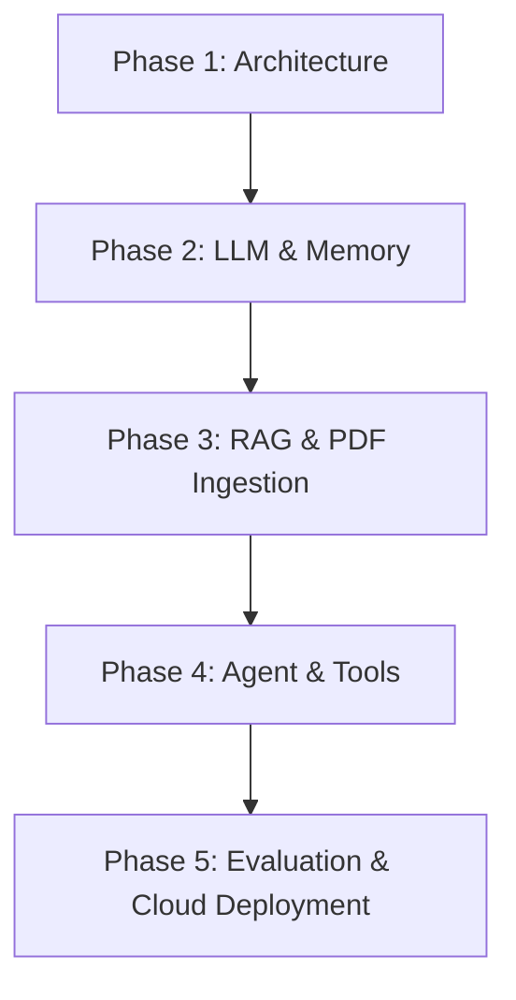

# EduMentor AI — Phase 1: Foundation & Project Architecture

EduMentor AI is a production-quality Socratic Tutor and Educational Assistant designed to guide students using the Socratic method of dialogue, while also supporting RAG-based document exploration, quiz generation, and career tracking.

**This release represents Phase 1: Foundation & Project Architecture.** 
All core modules, structures, configuration managers, logs, and user interfaces are set up as clean, modular Python packages with strict type-hinting, docstrings, and logger routines. No AI logic, LLM calling wrapper integrations, or database connections are active.

---

## Folder Structure

The project conforms strictly to the following layout:

```text
EduMentor-AI/
├── app.py                  # Streamlit entrypoint (under 100 lines)
├── config.py               # Centralized configuration (loads environment variables)
├── requirements.txt        # Categorized application dependencies
├── README.md               # Architecture documentation
├── .env.example            # Environment variables template
├── .gitignore              # Files/folders excluded from source control
│
├── assets/                 # Graphics, fonts, and styling elements
│
├── data/
│   └── uploads/            # Temporary directory for student uploaded PDFs
│
├── vector_db/              # Directory for persisted ChromaDB vector stores
│
├── logs/                   # Rotational text files generated by system loggers
│
├── screenshots/            # Visual layout design artifacts
│
├── tests/                  # Automated pytest testing files
│
└── modules/                # Core python packaging logic
    ├── __init__.py         # Exposes all module managers
    ├── ui.py               # Streamlit custom layout visuals (CSS / layout)
    ├── llm.py              # LLM engine client manager placeholder
    ├── prompts.py          # Instructional prompts template manager placeholder
    ├── rag.py              # RAG pipeline workflow coordinator placeholder
    ├── memory.py           # Windowed dialogue history memory placeholder
    ├── tools.py            # External actions tool manager registry placeholder
    ├── agent.py            # Primary cognitive agent planner placeholder
    ├── pdf_loader.py       # PDF parsing & text preprocessing placeholder
    ├── embeddings.py       # Sentence Embeddings manager placeholder
    ├── vector_store.py     # ChromaDB database client connector placeholder
    ├── logger.py           # Unified stdout & rotating file logs builder
    ├── constants.py        # Centralized system constants and states keys
    └── utils.py            # File, formatting, and path helper placeholders
```

---

## Technical Stack

| Layer | Technology | Purpose |
|---|---|---|
| **Frontend** | Streamlit | Rapid development of interactive UI layouts |
| **Backend** | Python 3.12+ | Core programming runtime |
| **LLM Engine** | Groq (Llama 3 70B) | High-speed inference provider |
| **Orchestration**| LangChain | Agent planning loops and tool execution bindings |
| **Vector DB** | ChromaDB | Local vector store for document indexing |
| **Embeddings** | HuggingFace Sentence Transformers | Semantic text-to-vector encoder |
| **PDF Extraction**| PyPDF | Document page parsing and token extraction |
| **Web Search** | DuckDuckGo API | External tool integration for real-time lookups |

---

## Design Principles

- **SOLID Principles:** Every component has a single responsibility. Interfaces are decoupled to prevent breaking changes during future implementation phases.
- **Separation of Concerns:** Business logic, UI components, prompting structures, database writes, and LLM executions reside in dedicated modules.
- **Production-Ready Logging:** All systems load unified rotating loggers pointing to local files and console streams.
- **Dry & Kiss:** Clear configurations, type hints, and robust exception frameworks prevent code duplication.

---

## Setup & Installation

### 1. Clone the repository
Ensure you are in the project workspace folder:
```powershell
cd "c:\Users\Deep\Documents\Tech\AI Analizer"
```

### 2. Configure Environment Variables
Copy `.env.example` to `.env`:
```powershell
cp .env.example .env
```
Provide your Groq API key and customize settings in the generated `.env` file.

### 3. Install Dependencies
```powershell
pip install -r requirements.txt
```

### 4. Run the Streamlit Application
```powershell
streamlit run app.py
```

---

## Future Roadmap



- **Phase 1 (Current):** Setup framework foundation.
- **Phase 2:** Integrate Groq API, LangChain ChatGroq, PromptManager templates, and ConversationMemory buffers.
- **Phase 3:** Integrate PyPDF extraction, Sentence-Transformers model caching, and ChromaDB vector persistence layers.
- **Phase 4:** Setup AIAgent planning loop, ToolManager routing, and bind DuckDuckGo searching, Calculator execution, and Wikipedia querying.
- **Phase 5:** Implement comprehensive unit tests, security audits, and deploy to Streamlit Cloud.

---

## Contributors
Developed by the **EduMentor AI Team**.

---

## License
MIT License. Refer to the LICENSE documentation for more details.
